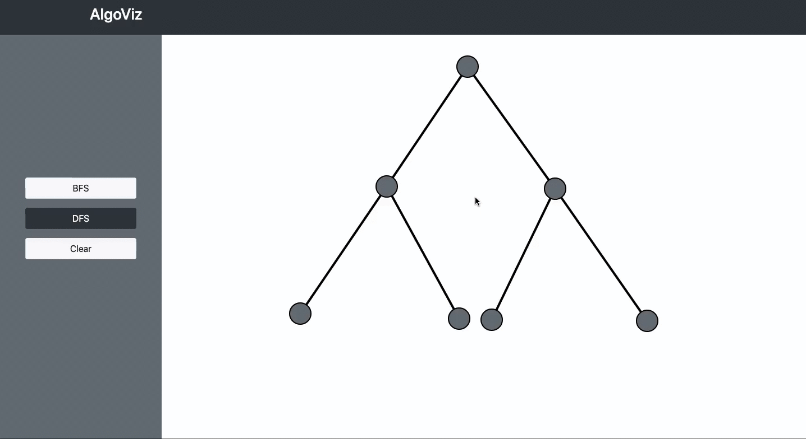
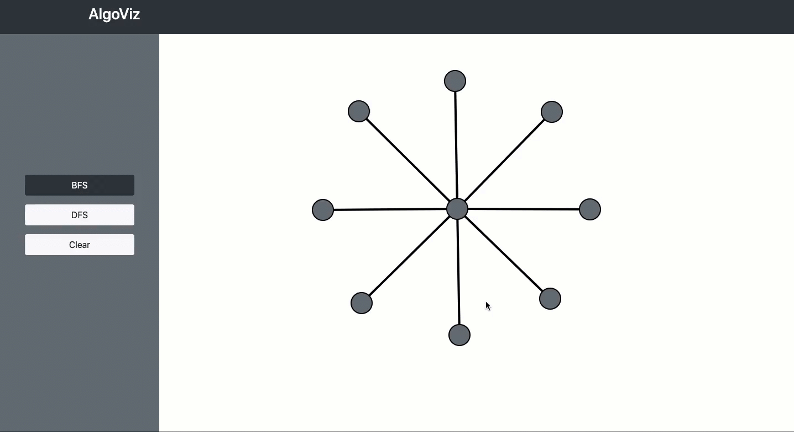
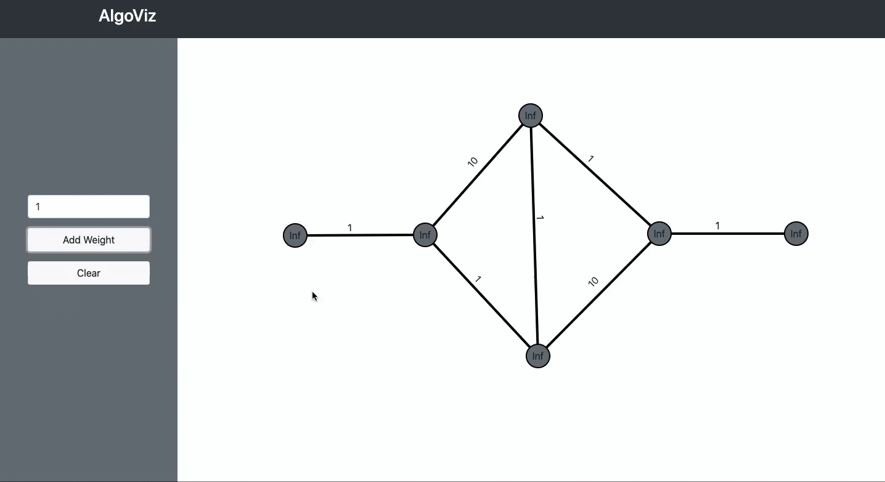
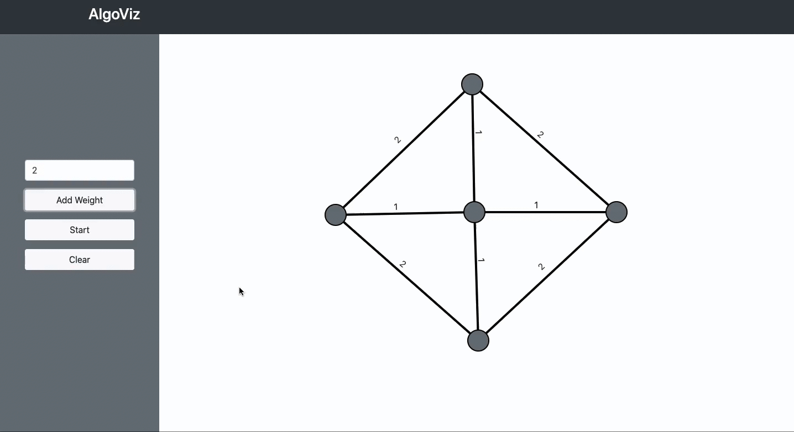
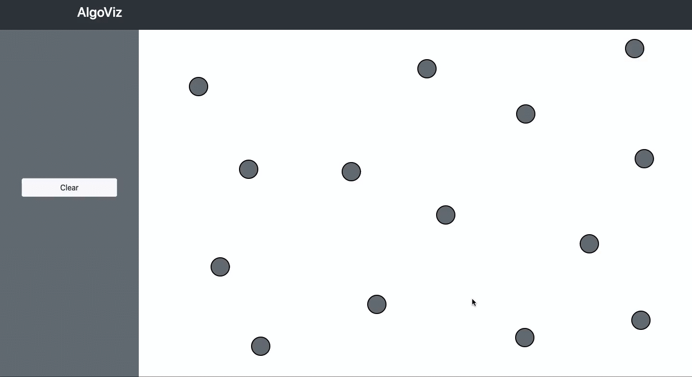
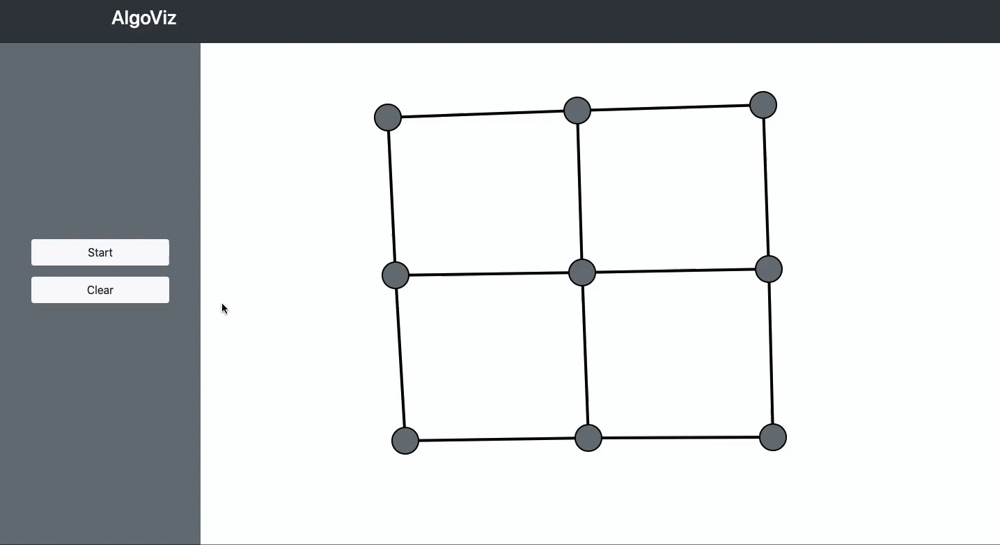
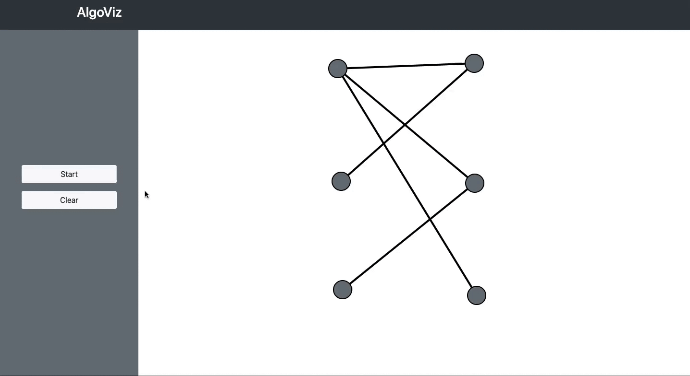
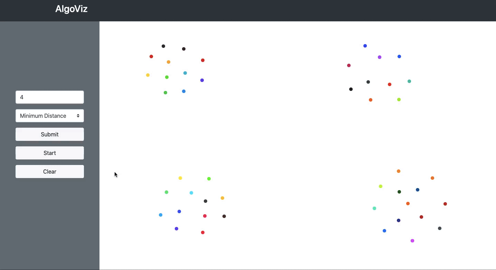

# [Algorithm Visualizer](https://competent-keller-247a1a.netlify.app/)

Table of Contents

- [About](#about)
  - [Built With](#built-with)
- [Visualisations](#visualisations)
  - [DFS](#dfs)
  - [BFS](#bfs)
  - [Dijkstra](#dijkstra)
  - [Kruskal's Algorithm](#kruskals-algorithm)
  - [Travelling Salesman](#travelling-salesman)
  - [Vertex Cover](#minimum-vertex-cover)
  - [Kuhn's Algorithm (Bipartite Matching)](#kuhns-algorithm)
  - [Agglomerative Clustering](#agglomerative-clustering)
- [Getting Started](#getting-started)
  - [Prerequisites](#prerequisites)
  - [Usage](#usage)
- [Acknowledgements](#acknowledgements)

## About

<table>
<tr>
<td>

This project is built to help students understand algorithms in an easier and intuitive way. It gives them the freedom to come with their own examples
and see how would a particular algorithm work on those examples. According to [The Learning Pyramid](https://tofasakademi.com/wp-content/uploads/2019/08/Learnin-Pyramid-740x642.png),
our retention rate is much more when we try to learn with the help of audio/video aids then simply attending lectures or even reading. Keepking this in mind, 
I have implemented 10 algorithms and tried to visualise what happens at every step in all algorihtms except DBSCAN (I couldn't come up with a good enough way to visualise this 
algorithm). Three of them are ML clustering algorithms and the rest come under the category of graph algorithms. 

The algorithms I have implemented are:
- DFS (Depth First Search)
- BFS (Breadth First Search)
- Dijkstra's Algorithm (Single Source Shortest Path)
- Kruskal's Algorithm (Minimum Spanning Tree)
- Travelling Salesman (2-Approx Algorithm)
- Vertex Cover (2-Approx Algorithm)
- Kuhn's Algorithm (Maximum Bipartite Matching)
- K-Means (Clustering Algorithm)
- Agglomerative Clustering (Clustering Algorithm)
- DBSCAN (Clustering Algorithm)

</td>
</tr>
</table>

### Built With

- [Canvas](https://developer.mozilla.org/en-US/docs/Web/API/Canvas_API)
- Javascript
- Bootstrap 
- HTML
- CSS

## Visualisations
### DFS

### BFS

### Dijkstra

### Kruskal's Algorithm

### Travelling Salesman 

### Minimum Vertex Cover

### Kuhn's Algorithm

### Agglomerative Clustering

## Getting Started
### Prerequisites
It would be helpful to know what problem does a particular algorithm solve before trying to visualise it.
### Usage
#### DFS/BFS
- First draw the nodes by clicking anywhere on the drawing screen.
- Then add the edges by clicking on a node and dragging to the other node.
- Select BFS/DFS from the menu on the left.
- Double Click on the node from which you want to start the BFS/DFS.
#### Dijkstra
- First draw the nodes by clicking anywhere on the drawing screen.
- Now draw the edges in the same manner as before. 
**NOTE:** Remember to add edge weight to current edge before drawing the next edge because you will not be able to draw anything unless you assign the weight to drawn edge. 
You will not even be able to start the algorithm if the weight is not assigned. Also the edge weight has to be in between 0 and 50.
- After drawing the graph, double click on any node from which you want to start the algorithm.
#### Kruskal's Algorithm
- First draw the nodes by clicking anywhere on the drawing screen.
- Now draw the edges in the same manner as before. 
**NOTE:** Remember to add edge weight to current edge before drawing the next edge because you will not be able to draw anything unless you assign the weight to drawn edge. 
You will not even be able to start the algorithm if the weight is not assigned. Also the edge weight has to be in between 0 and 50.
- After drawing the graph, click on the start button on the left side of the screen.
#### Travelling Salesman
- Draw the nodes by clicking on the screen.
- After marking the locations on the screen, double click on any node from where you want the salesman to start his journey.
#### Vertex Cover 
- Draw the graph by following the same steps as in DFS/BFS.
- After drawing the graph, click on the start button on the left side of the screen.
#### Maximum Bipartite Matching 
- Draw the graph by following the same steps as in DFS/BFS.
- After drawing the graph, click on the start button on the left side of the screen.
#### K-Means
- Enter the number of clusters you want your data points to be partioned into and then click submit. **NOTE:** The number of clusters has to be in between 1 and 7, otherwise it will take value 7.
- Draw the data points by clicking on the screen. **NOTE:** You will not be allowed to draw the data points before you enter the number of clusters.
- After drawing the data points, click on the start button.
#### Agglomerative Clustering
- Enter the number of clusters you want your data points to be partioned into and also choose the similarity criteria you want for merging clusters at every step. After this, click submit.
- Draw the data points by clicking on the screen. **NOTE:** You will not be allowed to draw the data points before you enter the number of clusters and choose the similarity criteria.
- After drawing the data points, click on the start button.
#### DBSCAN
- Enter the value of epsilon and also minPoints and then click submit.
- Draw the data points by clicking on the screen. **NOTE:** You will not be allowed to draw the data points before you enter the value of epsilon and minPoints.
- After drawing the data points, click on the start button.
- **NOTE:** After the algorithm finishes the border points would be coloured grey.

## Acknowledgements
Thanks for these awesome resources that were used during the development of the **Algorithm Visualiser** and also this README:
- <https://developer.mozilla.org/en-US/docs/Web/API/Canvas_API>
- <https://cp-algorithms.com/graph/kuhn_maximum_bipartite_matching.html>
- <https://github.com/dec0dOS/amazing-github-template>
- <https://kapwing.com>
